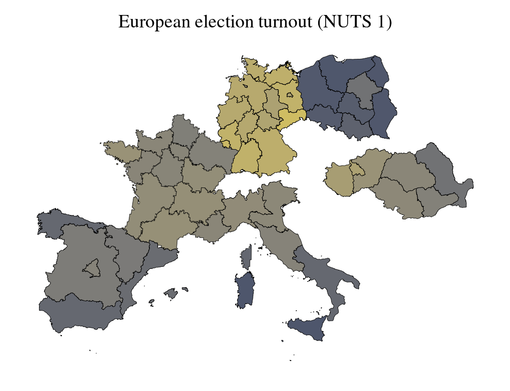
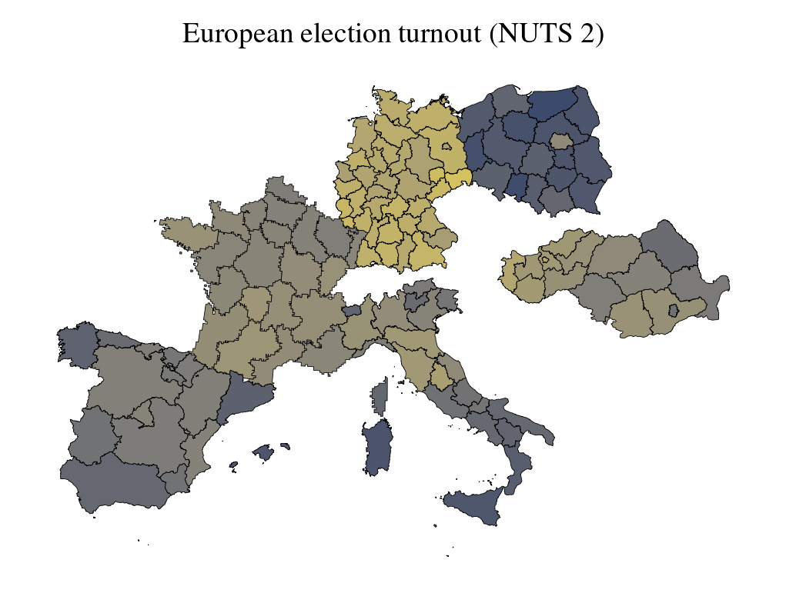
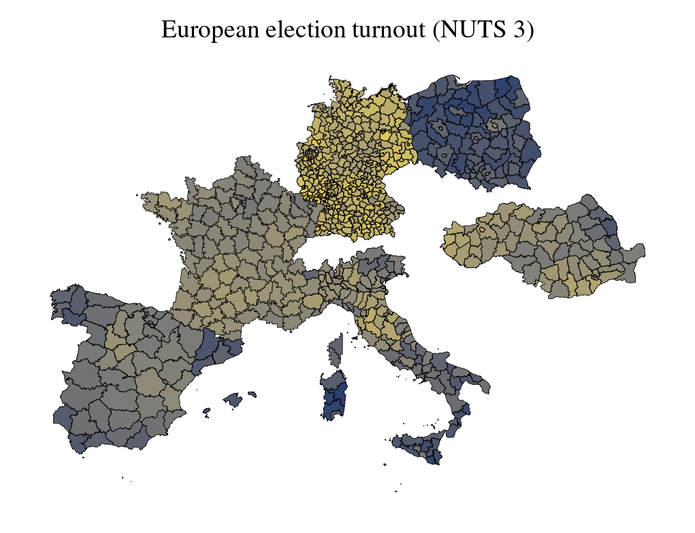

# Election data from European countries

<p align="center">
  
  <div align="center" style="font-style: italic;">Latest european election turnout.</div>
</p>

## Abstract

This repository contains raw data about elections (public domain unless specified otherwise), and provides metadata to aggregate into NUTS regions to be used with, for example, Eurostat datasets.

## Countries covered
| Country | Years      | Election Types             | Resolution                                           | Data Source | Download                                            | Metadata                                                 |
|---------|------------|----------------------------|------------------------------------------------------|-------------|-----------------------------------------------------|----------------------------------------------------------|
| Poland  | 2000-2025  | sejm, president, european  | powiat (380 units, 75k persons)                      | [1]         | [CSV](./data/downloads/poland_best_resolution.csv)  | [Metadata](./data/downloads/poland_region_metatada.csv)  |
| Germany | 1990-2025  | bundestag, european        | kreis (400 units, 200k persons)                      | [2]         | [CSV](./data/downloads/germany_best_resolution.csv) | [Metadata](./data/downloads/germany_region_metatada.csv) |
| France  | 1999-2025  | president, european        | departament (approx. NUTS3, 100 units, 680k persons) | [3]         | [CSV](./data/downloads/france_best_resolution.csv)  | [Metadata](./data/downloads/france_region_metatada.csv)  |
| Italy   | 1996-2025  | camera, european           | NUTS3 (approx. province, 100 units, 500k persons)    | [4]         | [CSV](./data/downloads/italy_best_resolution.csv)   | [Metadata](./data/downloads/italy_region_metatada.csv)   |
| Spain   | 1999-2025  | congresso, european        | provincia (approx NUTS3, 51 units, 960k persons)     | [5,6]       | [CSV](./data/downloads/spain_best_resolution.csv)   | [Metadata](./data/downloads/spain_region_metatada.csv)   |
| Romania | 1992-2025  | house, president, european | NUTS3 (approx. judete, 42 units, 40k persons)        | [7]         | [CSV](./data/downloads/romania_best_resolution.csv) | [Metadata](./data/downloads/romania_region_metatada.csv) |
| Hungary | 2000-2025  | parliament, european       | telepules (3155 units, 3k persons)                   | [8]         | [CSV](./data/downloads/hungary_best_resolution.csv) | [Metadata](./data/downloads/hungary_region_metatada.csv) |

Approx NUTS3 - Can differ from NUTS3 in case of islands.
You can use metadata files to aggregate election results at the desired level.

references:
 - [1] - Own work based on [Dane Wyborcze KBW](https://danewyborcze.kbw.gov.pl).
 - [2] - Own work based on [Bundeswahlleiterin](https://www.bundeswahlleiterin.de/europawahlen/2024/publikationen.html) european results and [BBSR cross tables](https://www.bbsr.bund.de/BBSR/DE/forschung/raumbeobachtung/Raumabgrenzungen/umstiegsschluessel/umsteigeschluessel.html)
 - [3] - Aggregation of data available via French public repository [Results by departement](https://www.data.gouv.fr/datasets/donnees-des-elections-agregees/)
 - [4] - Own work based on Italian database [Elezion Istorico](https://elezionistorico.interno.gov.it/eligendo/opendata.php)
 - [5] - Own work based on Ministry of Interior province aggregates [data](https://infoelectoral.interior.gob.es/es/elecciones-celebradas/area-de-descargas/)
 - [6] - (EP elections: 1999,2004,2009) Aggregation of data from [EUNED](https://eu-ned.com/datasets/)
 - [7] - Aggregation of data from [Commit Global - Rezultate Vot](https://istoric.rezultatevot.ro/) - CC BY 4.0
 - [8] - Aggregation of data from [valasztas.hu](https://www.valasztas.hu/home) ([see also](https://static.valasztas.hu/dyn/letoltesek/valasztasi_eredmenyek_1990-2024.zip))

## NUTS aggregated downloads

### Vote data

|  | NUTS 1 | NUTS 2 | NUTS 3 |
|--|--------|--------|--------|
|  |  |  |  |
| Poland  | [CSV](./data/downloads/poland_nuts_1.csv) | [CSV](./data/downloads/poland_nuts_2.csv) | [CSV](./data/downloads/poland_nuts_3.csv) |
| Germany | [CSV](./data/downloads/germany_nuts_1.csv) | [CSV](./data/downloads/germany_nuts_2.csv) | [CSV](./data/downloads/germany_nuts_3.csv) |
| France  | [CSV](./data/downloads/france_nuts_1.csv) | [CSV](./data/downloads/france_nuts_2.csv) | [CSV](./data/downloads/france_nuts_3.csv) |
| Italy   | [CSV](./data/downloads/italy_nuts_1.csv) | [CSV](./data/downloads/italy_nuts_2.csv) | [CSV](./data/downloads/italy_nuts_3.csv) |
| Spain   | [CSV](./data/downloads/spain_nuts_1.csv) | [CSV](./data/downloads/spain_nuts_2.csv) | [CSV](./data/downloads/spain_nuts_3.csv) |
| Romania | [CSV](./data/downloads/romania_nuts_1.csv) | [CSV](./data/downloads/romania_nuts_2.csv) | [CSV](./data/downloads/romania_nuts_3.csv) |
| Hungary | [CSV](./data/downloads/hungary_nuts_1.csv) | [CSV](./data/downloads/hungary_nuts_2.csv) | [CSV](./data/downloads/hungary_nuts_3.csv) |

### Map files

|  | NUTS 1 | NUTS 2 | NUTS 3 |
|--|--------|--------|--------|
|  |  |  |  |
| Poland  | [geojson](./data/downloads/poland_nuts_1.geojson) | [geojson](./data/downloads/poland_nuts_2.geojson) | [geojson](./data/downloads/poland_nuts_3.geojson) |
| Germany | [geojson](./data/downloads/germany_nuts_1.geojson) | [geojson](./data/downloads/germany_nuts_2.geojson) | [geojson](./data/downloads/germany_nuts_3.geojson) |
| France  | [geojson](./data/downloads/france_nuts_1.geojson) | [geojson](./data/downloads/france_nuts_2.geojson) | [geojson](./data/downloads/france_nuts_3.geojson) |
| Italy   | [geojson](./data/downloads/italy_nuts_1.geojson) | [geojson](./data/downloads/italy_nuts_2.geojson) | [geojson](./data/downloads/italy_nuts_3.geojson) |
| Spain   | [geojson](./data/downloads/spain_nuts_1.geojson) | [geojson](./data/downloads/spain_nuts_2.geojson) | [geojson](./data/downloads/spain_nuts_3.geojson) |
| Romania | [geojson](./data/downloads/romania_nuts_1.geojson) | [geojson](./data/downloads/romania_nuts_2.geojson) | [geojson](./data/downloads/romania_nuts_3.geojson) |
| Hungary | [geojson](./data/downloads/hungary_nuts_1.geojson) | [geojson](./data/downloads/hungary_nuts_2.geojson) | [geojson](./data/downloads/hungary_nuts_3.geojson) |
|         |  |  |  |
| Poland  | [topojson](./data/downloads/poland_nuts_1.topojson) | [topojson](./data/downloads/poland_nuts_2.topojson) | [topojson](./data/downloads/poland_nuts_3.topojson) |
| Germany | [topojson](./data/downloads/germany_nuts_1.topojson) | [topojson](./data/downloads/germany_nuts_2.topojson) | [topojson](./data/downloads/germany_nuts_3.topojson) |
| France  | [topojson](./data/downloads/france_nuts_1.topojson) | [topojson](./data/downloads/france_nuts_2.topojson) | [topojson](./data/downloads/france_nuts_3.topojson) |
| Italy   | [topojson](./data/downloads/italy_nuts_1.topojson) | [topojson](./data/downloads/italy_nuts_2.topojson) | [topojson](./data/downloads/italy_nuts_3.topojson) |
| Spain   | [topojson](./data/downloads/spain_nuts_1.topojson) | [topojson](./data/downloads/spain_nuts_2.topojson) | [topojson](./data/downloads/spain_nuts_3.topojson) |
| Romania | [topojson](./data/downloads/romania_nuts_1.topojson) | [topojson](./data/downloads/romania_nuts_2.topojson) | [topojson](./data/downloads/romania_nuts_3.topojson) |
| Hungary | [topojson](./data/downloads/hungary_nuts_1.topojson) | [topojson](./data/downloads/hungary_nuts_2.topojson) | [topojson](./data/downloads/hungary_nuts_3.topojson) |


## How to cite

*Harmonised results of some European elections* Radost Waszkiewicz; (2025)
```bibtex
@misc{Waszkiewicz_2025,
  author       = {Waszkiewicz, Radost},
  title        = {Harmonised results of some European elections},
  year         = {2025},
  howpublished = {\url{https://github.com/RadostW/europe-elections}},
  note         = {GitHub repository},
  version      = {v1.2.0}
}
```

## Testing

Tests are taking advantage of `pytest` framework.
Simply run

```python
  pytest -v tests/
```

## License

All software in this repository is licensed under GPL v 3.0 or later.

Copyright (C) 2025 Radost Waszkiewicz

Raw datasets are public domain unless stated otherwise. Derived datasets are licensed under CC-BY-SA 4.0, or CC-BY-SA 3.0, or GPL v 3.0 or later, at the users choice.