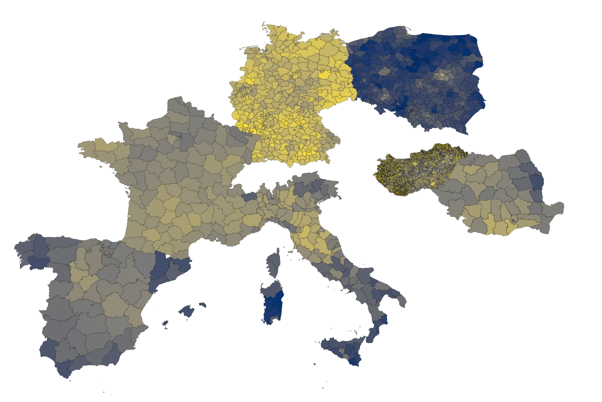

# Election data from European countries

<p align="center">
  
</p>

## Abstract

This repository contains raw data about elections (public domain unless specified otherwise), and provides metadata to aggregate into NUTS regions to be used with, for example, Eurostat datasets.

## Countries covered
| Country | Years      | Election Types            | Resolution                            | Data Source | Download | Metadata |
|---------|------------|---------------------------|---------------------------------------|-------------|----------|----------|
| Poland  | 2000-2025  | sejm, president, european | powiat (380 units, 75k persons)       | [1]         | [CSV](./data/downloads/poland.csv)  | [Metadata](./data/downloads/poland_metadata.csv)  |
| Germany | 1990-2025  | bundestag, european       | kreis (400 units, 200k persons)       | [2]         | [CSV](./data/downloads/germany.csv) | [Metadata](./data/downloads/germany_metadata.csv) |
| France  | 1999-2025  | president, european       | departament (100 units, 680k persons) | [3]         | [CSV](./data/downloads/germany.csv) | [Metadata](./data/downloads/france_metadata.csv)  |
| Italy   | WIP        | camera, european          | province (100 units, 500k persons)    | .           | .                                   | .                                                 |

You can use metadata files to aggregate election results at the desired level.

references:
 - [1] - Own work based on [Dane Wyborcze KBW](https://danewyborcze.kbw.gov.pl).
 - [2] - Own work based on [Bundeswahlleiterin](https://www.bundeswahlleiterin.de/europawahlen/2024/publikationen.html) european results and [BBSR cross tables](https://www.bbsr.bund.de/BBSR/DE/forschung/raumbeobachtung/Raumabgrenzungen/umstiegsschluessel/umsteigeschluessel.html)
 - [3] - Aggregation of data available via French public repository [Results by departement](https://www.data.gouv.fr/datasets/donnees-des-elections-agregees/)

## How to cite

*Harmonised results of some European elections* Radost Waszkiewicz; (2025)
```bibtex
@misc{Waszkiewicz_2025,
  author       = {Waszkiewicz, Radost},
  title        = {Harmonised results of some European elections},
  year         = {2025},
  howpublished = {\url{https://github.com/RadostW/europe-elections}},
  note         = {GitHub repository},
  version      = {v1.2.0}
}
```

## License

All software in this repository is licensed under GPL v 3.0 or later.

Copyright (C) 2025 Radost Waszkiewicz

Raw datasets are public domain unless stated otherwise. Derived datasets are licensed under CC-BY-SA 4.0, or CC-BY-SA 3.0, or GPL v 3.0 or later, at the users choice.
